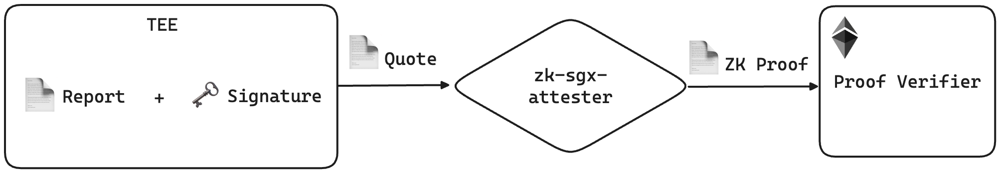
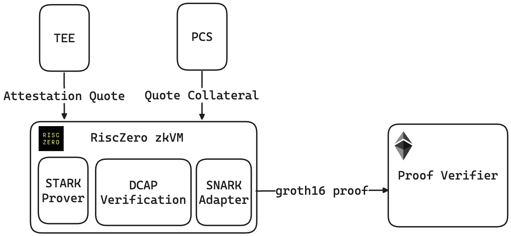

# zk-sgx-attester

The utilities to verify SGX attestation quote on-chain by moving DCAP verification to off-chain zkVM. Check [development guide](./local-development.md) to run whole stuff locally.

### **Why We Need Trustless Attestation Verification**

Remote attestation is the foundational trust mechanism for TEEs. If we cannot make it trustless, we cannot genuinely trust the platform on which we are running our applications. Unlike traditional Web2 cloud providers that run attestation services in a black box, a trustless attestation mechanism ensures transparency and verifiability, which are essential for decentralized and secure applications.

### **The Barriers to Verifying Quotes On-Chain (Ethereum)**

One way to make attestation trustless is to verify the attestation quote on-chain, enabling smart contracts to directly verify the results. However, this approach faces significant challenges, particularly on Ethereum:

- **High Gas Costs**: Verifying attestation quotes on Ethereum is prohibitively expensive due to high gas costs.
- **Lack of Cryptographic Primitives**: Solidity, Ethereum's smart contract language, lacks support for some essential cryptographic primitives needed for quote verification.
    - To verify the [**quote**](https://github.com/tolak/zk-dcap-verifier/blob/main/res/dcap_quote) and the accompanying [**collateral**](https://github.com/tolak/zk-dcap-verifier/blob/main/res/dcap_quote_collateral), we need to handle x.509 certificates.
    - The P256 curve, required for these certificates, is poorly supported in Solidity. Additionally, verifying the certification chain incurs substantial gas costs.

### **How RiscZero zkVM Plays a Role**

Instead of verifying the quote directly on Ethereum, we can leverage RiscZero's zkVM to handle the quote verification off-chain and only submit the proof on-chain. Here’s how it works:

1. **Off-Chain Quote Verification**:
    - RiscZero's zkVM can execute the quote verification process using full Rust libraries. This includes accessing JSON, WebPKI certificate libraries, and cryptographic libraries easily.
    - By running the quote verification with DCAP in RiscZero zkVM, we ensure that the process is secure and efficient. The zkVM acts as part of the guest code, handling the complexities of verification.
2. **Generating Proof with STARK and SNARK**:
    - Under the hood, RiscZero zkVM uses a STARK prover to validate the verification program. This is then converted into a SNARK proof, specifically a Groth16 zk proof, which is very cheap to verify on-chain.
    - This approach significantly reduces the computational burden and gas costs associated with on-chain verification.
3. **On-Chain Verification by Smart Contracts**:
    - Once the SNARK proof is generated, it can be submitted to a smart contract on Ethereum for verification.
    - The smart contract can then verify if a TEE is valid by submitting a remote attestation request.
    - A relay program is needed to catch requests from the smart contract and write back the proof to Ethereum, ensuring seamless communication between off-chain and on-chain components.

By leveraging RiscZero zkVM, we can make the remote attestation process trustless, efficient, and scalable. This approach not only enhances the security and transparency of TEE-based applications but also opens up new possibilities for integrating TEEs with blockchain technologies.

